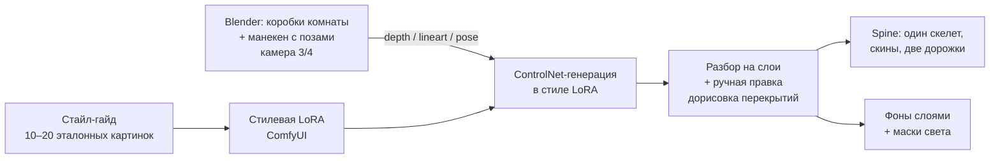

# Производство арта без художника

<!-- решения приняты в дизайн-сессии 2026-09-25 (#77) -->

## Две проблемы

Генерация картинки — не главная трудность. Главных две:

- **одинаковость** — стиль, ракурс и персонаж совпадают на сотнях картинок;
- **движение** — картинку рисует нейросеть, а двигать её приходится руками.

Поэтому у каждого инструмента в связке одна роль.

## Связка

`[РЕШЕНО]` Рисованная 2D: Blender для ракурса и поз → ControlNet со стилевой LoRA → разбор на
слои → Spine.

1. **Стайл-гайд.** Направление ищется в любом генераторе; результат — 10–20 эталонных
   картинок, палитра, толщина контура.
2. **Стилевая LoRA.** Дообучение открытой модели на эталонах. Держит один стиль на всех
   ассетах; без неё каждая новая картинка — «немного другая игра».
3. **Blender отвечает за геометрию, а не за рисунок.** Комната и арена собираются из коробок,
   камера 3/4 ставится один раз; глубина и контуры идут в ControlNet — у всех фонов один
   ракурс. Манекен в нужной позе даёт позу-подсказку, и все детали персонажа рисуются в одной
   проекции.
4. **Разбор на детали.** Модель раскладывает картинку на RGBA-слои, но стыки рук и шеи для
   риггинга чистятся и дорисовываются вручную.
5. **Spine** — анимация, `design/ui.md`. Нейросети этот этап не закрывают: это основной ручной
   труд.
6. **Свет.** Маски засветок — мониторы, лампа — рисуются отдельными слоями и накладываются
   поверх сцены.

## Отвергнуто

- **Полное 3D в Blender с пререндером в спрайт-листы.** У каждого персонажа свои кадры, общий
  скелет со скинами пропадает; 6 персонажей × ~30 клипов × ~12 кадров — это тысячи кадров и
  сотни мегабайт текстур на телефоне (оценка, не замер). Рендер 3D в самой игре ломает стек
  `adr/0008`.
- **Облачный генератор без LoRA и Blender.** Одинаковость разваливается уже на третьем
  персонаже.
- **Плоский cutout** — проще всего без художника, но слишком скучно.

## Правила

Происхождение каждого ассета, ручная доработка и лицензии моделей — `adr/0015`. Сходство с
реальными людьми, командами, играми и картами — дефект (`adr/0005`); нейросеть выдаёт его
легко. Конкретные модели не фиксируются здесь: они меняются быстрее документа.

---
