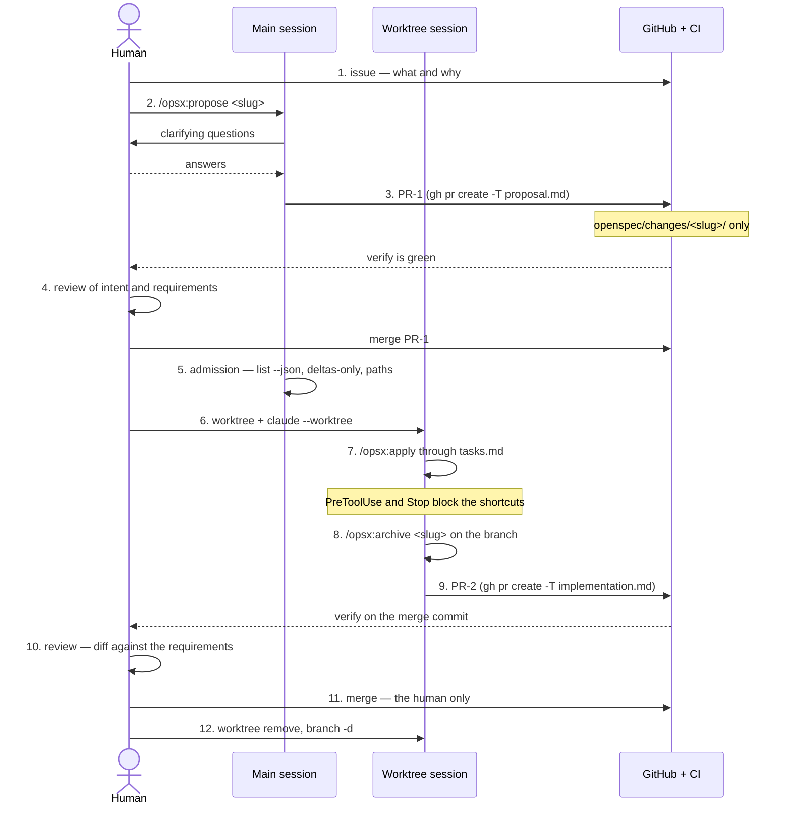

# How a task is developed

The route from a filed issue to merged code. This file is the digest — the decisions behind
it live in `docs/adr/0009` (the spec loop), `docs/adr/0012` (branch names) and
`docs/adr/0013` (comments); `CLAUDE.md` holds the short form an agent reads every session.

Keep it current: when the loop changes, this file changes in the same pull request.

## Who takes part

| Role | Decides |
|---|---|
| Human | what we build, whether it is acceptable, when to merge |
| Main session | how to express the task as requirements |
| Worktree session | code against requirements that are already accepted |
| Gates | pass or stop: linter, hooks, `pnpm verify`, the ruleset on `master` |

## The loop



## The steps

**1. Task.** An issue: what and why, no mechanics. A label picks the track:
`mechanic`, `content`, `balance`, `tooling`, `process`. Order and dependencies live in
sub-issues and `blocked by`.

**2. Proposal.** `/opsx:propose <slug>` in the main session. The agent asks its questions,
and together you get `proposal.md` with an "Affects" section listing the paths, the
requirement delta, `design.md` and `tasks.md`. No code yet. A proposal that runs into an
accepted ADR stops and opens an issue `ADR NNNN blocks <slug>` — a decision is never worked
around by rewording a requirement.

**3. PR-1.** Branch `<type>/<issue>-<slug>`, for example `feat/7-week-loop`. It carries the
change directory and nothing else. Opened with `gh pr create -T proposal.md`: GitHub does
not apply a template from `PULL_REQUEST_TEMPLATE/` on its own.

**4. First review — the cheap one.** You read the requirements, not the code. An objection
costs one sentence here and a rewrite later. The human merges.

**5. Admission.** `openspec list --json` plus `openspec show <slug> --json --deltas-only`.
An overlap in requirements or in declared paths with a change already in flight means "queue
behind it", not "merge and hope". Done by hand until `tools/dispatch` exists.

**6. Worktree.** The branch first, the session second — the flag alone would name the branch
`worktree-<name>`, and that name cannot be configured:

```
git worktree add .claude/worktrees/7-week-loop -b feat/7-week-loop origin/master
claude --worktree 7-week-loop
pnpm install
```

**7. Implementation.** `/opsx:apply` walks `tasks.md`. Three gates run inside the session:
`PreToolUse` refuses edits to `test/golden/**`, `openspec/specs/**` and
`.claude/commands/opsx/**`; `Stop` refuses to end a turn while `pnpm verify` is red;
`SessionStart` puts the pinned `openspec` first on `PATH`. A problem in the plan stops the
work and changes the proposal in its own pull request — accepted requirements are never
widened in place.

**8. The spec catches up with the code.** `openspec archive <slug> -y` on the branch: the
delta merges into `openspec/specs/`, the change directory moves to `changes/archive/`. On
the branch on purpose — a disagreement between two changes then surfaces as a git conflict
during rebase, before the merge rather than after it.

**9. PR-2.** Code plus the updated spec, opened with `gh pr create -T implementation.md`.
CI runs `verify` on the merge commit, so a snapshot invalidated by a neighbouring merge
turns red here rather than on `master`.

**10. Second review.** One question: does the diff do exactly the accepted requirements and
nothing else. Review notes go to `.reviews/`, which is gitignored — whatever must survive
the review moves on: a defect to an issue, a decision to an ADR, behavior to a spec delta,
a remark to the pull request itself.

**11. Merge is the human's action.** The agent opens the PR, reports the green gate and
stops. A green CI is not permission.

**12. Cleanup.** GitHub deletes the remote branch; locally
`git worktree remove .claude/worktrees/<name>` and `git branch -d <branch>` — a worktree
created by hand is never swept automatically.

## Side routes

| Case | Route |
|---|---|
| Tooling, infrastructure, documentation | same loop, but `skip_specs: true` in the change's `.openspec.yaml` at creation, otherwise the gate turns red |
| The code does not do what the spec says | the loop with an empty delta: the code is fixed, the spec stands |
| The spec says the wrong thing | the loop with a `MODIFIED` requirement |
| Balance numbers drifted | not a bug: run the harness, commit `baseline:` separately with an explanation |
| A golden test turned red | "the simulation drifted", not "fix the file": regeneration is its own PR with a `golden:` prefix |

## Not working yet

- **Step 5** — `tools/dispatch` is not written, admission is checked by hand.
- **The balance track** — `sim_harness` is not written, so numbers are taken on trust.
- **A fresh-context check** before step 10 — discussed, not implemented.
- The loop has not had a full live run yet: everything so far went through plain pull
  requests, because what changed was the harness itself.

